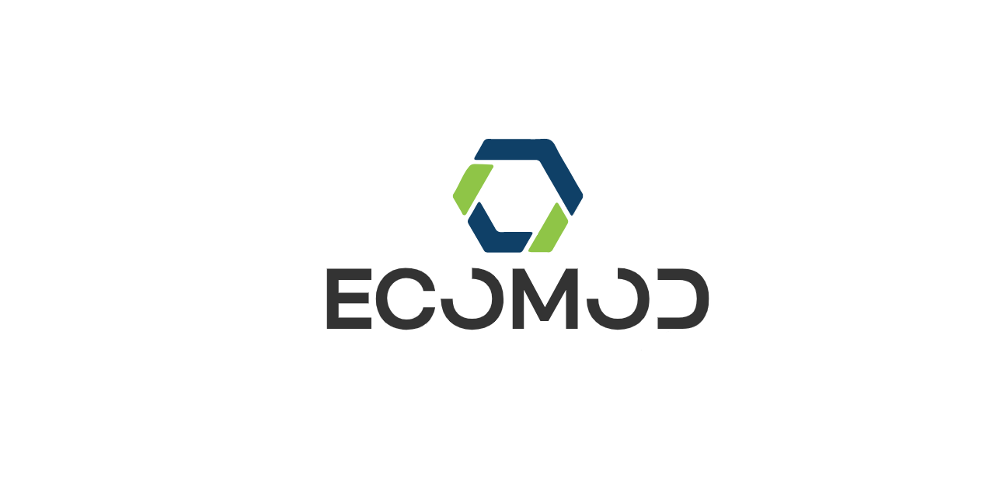

# EcoMod

A modeling support program for socio-economic processes. The system derives the necessary optimality conditions for complex economic models, in which agents plan their decisions based on optimal management tasks. We will introduce you to the input and output of the model formulation, the description of the optimal management tasks of agents and coordination of their solutions through interactions, the technological aspects of working with mathematical model formulations

About this project:
[Notion](https://bevel-metal-e15.notion.site/EcoMod-3862b537a5564a1084b81457e1d911a0)

Documentation: [ReadTheDocs](https://ecomod.readthedocs.io/en/latest/py-modindex.html)